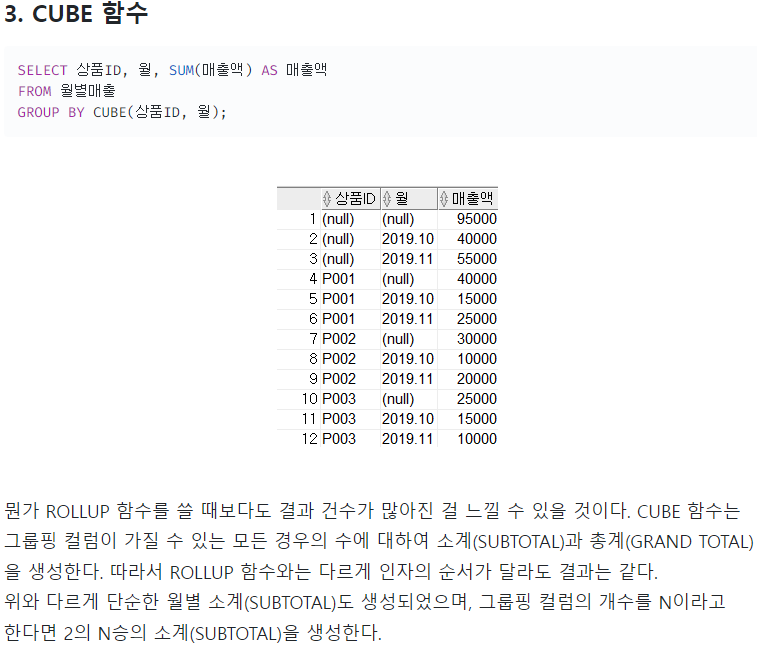
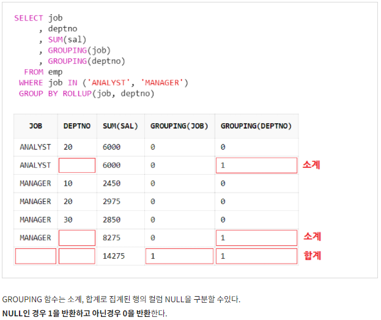

# <a href ="https://velog.io/@dongchyeon/%EC%98%A4%EB%9D%BC%ED%81%B4Oracle-%EA%B7%B8%EB%A3%B9-%ED%95%A8%EC%88%98-ROLLUP-CUBE-GROUPING-%EB%93%B1#3-cube-%ED%95%A8%EC%88%98">그룹함수</a>

- ## ROLLUP

```sql
문법)
GROUP BY ROLL UP(컬럼명1,컬럼명2)
하나의 그룹이 끝날때의 '소계'와 전체 로우에 대한 그룹화가 끝날때의 '총계'를 나타냄
-- ex)
-- SELECT empno,
--         SUM(SAL),
--         grouping(deptno)
-- FROM emp
-- GROUP BY ROLLUP(deptno, empno)
1. ROLLUP 의 첫번째 인자를 기준으로 그룹핑 되어서 결과출력.
2. GROUP BY ROLLUP()은 인자값의 순서가 중요하다.
--   deptno       SUM_SAL     empno
--     1            1000       1568
--     1            2000       1889
--     1            1500       1446
--     1            4500      (null)    --소계
--     2            2000       2336
--     2            2300       2489
--     2            4300      (null)    --소계
--     3            2500       3998
--     3            2200       3452
--     3            4700      (null)    --소계
--   (null)         13500     (null)    --총계
```

- ## CUBE

```sql
1. CUBE 함수는 그룹핑 컬럼이 가질 수 있는 모든 경우의 수에 대하여 소계(SUBTOTAL)과 총계(GRAND TOTAL)을 생성한다.
2. 결과 = deptno를 기준으로 한 소계 + empno를 기준으로 한 소계 + 전체 총계
3. 전체 총계는 deptno의 소계를 총계 내나 empno를 총계 내나 같은 값이 나오기 때문에 하나의 총계만 나온다.
4. 따라서 ROLLUP 함수와는 다르게 인자의 순서가 달라도 결과는 같다.
문법)
ex)
SELECT empno,
        SUM(SAL),
        grouping(deptno)
FROM emp
GROUP BY CUBE(deptno, empno)
```



- ## GROUPING SET

```sql
1. 컬럼1 소계(SUBTOTAL), 컬럼2 소계(SUBTOTAL) 따로따로 나온다.
문법)
ex)
SELECT empno,
        SUM(SAL),
        grouping(deptno)
FROM emp
GROUP BY GROUPING SET(deptno, empno)
```


- ## GROUP BY

- ## ★ GROUPING(컬럼명)

```sql
1. SELECT 절에서 사용 / ROLLUP 과 함께 사용
2. 그룹핑 항목의 데이터가 NULL인 경우 1을 반환하고 아닌경우 0을 반환한다.
3. GROUPING 을 사용 할 경우에는 GROUPING 할 컬럼들을 GROUP BY 항목에 넣어야 한다
```


