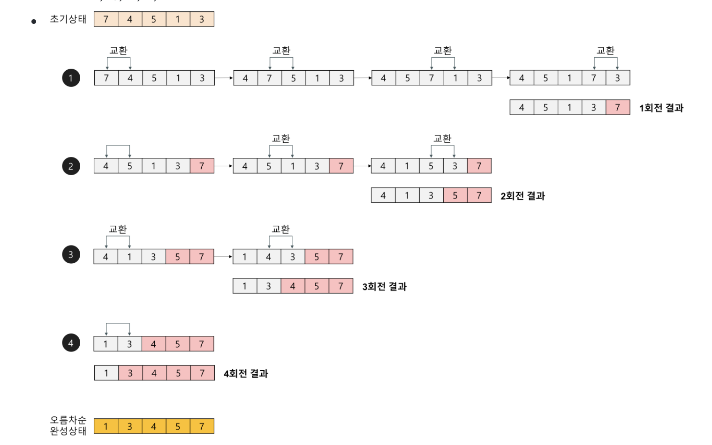

- # <a href="https://st-lab.tistory.com/195">버블 정렬 IN JAVA</a>

## 버블 정렬

    서로 인접한 두 원소를 검사하여 정렬하는 알고리즘
    자료구조에 기초적인 개념

### 버블 정렬 개념

- 버블 정렬은 첫 번째 자료와 두 번째 자료를, 두 번째 자료와 세 번째 자료를, 세 번째와 네 번째를, … 이런 식으로 (마지막-1)번째 자료와 마지막 자료를 비교하여 교환하면서 자료를 정렬한다.
- 1회전을 수행하고 나면 가장 큰 자료가 맨 뒤로 이동하므로 2회전에서는 맨 끝에 있는 자료는 정렬에서 제외되고, 2회전을 수행하고 나면 끝에서 두 번째 자료까지는 정렬에서 제외된다. 이렇게 정렬을 1회전 수행할 때마다 정렬에서 제외되는 데이터가 하나씩 늘어난다.

### 버블 정렬 과정

