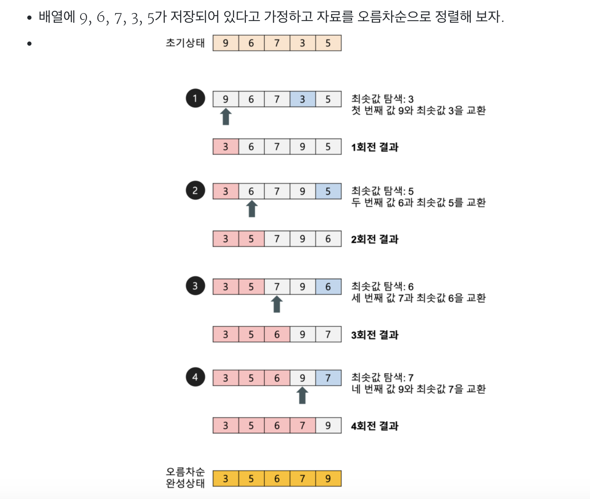

## 선택 정렬(Selection Sort)
    선택정렬은 제자리 정렬(in-place sorting) 알고리즘의 하나이며,
    해당 순서에 원소를 넣을 위치는 이미 정해져 있고, 그 위치에 어떤 원소를 넣을지 선택하는 알고리즘.

### 선택 정렬 특징
    자료 이동 횟수가 미리 결정된다는 장점이 있지만,
    값이 같은 원소가 있는 경우에 위치가 변경될 수 있다.
    단순하지만 비효율적인 정렬 알고리즘이다.(버블 정렬도 단순하고, 비효율적인 정렬방법)

### 버블 정렬 과정

